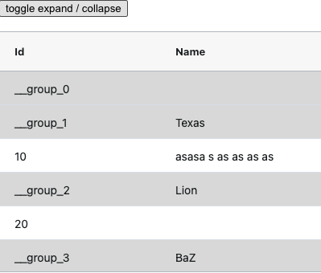
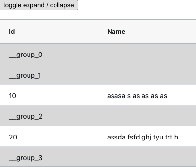

## What is this?

A demo of the ag-grid v30 **conditional colspan bug**. This is reproduced if you use colspan together with the infinite row model and `refreshInfiniteCache()`.

It's recommended to install the project and observe the bug, but screenshots are also provided.

## How to run?

### `npm i && npm start`

## Brief Details

The bug happens when the grid data is refreshed by using [`api.refreshInfiniteCache()`](https://ag-grid.com/javascript-data-grid/infinite-scrolling/#reference-infiniteScrolling-refreshInfiniteCache). 
After doing this, ag-grid displays the new data, [conditional styling](https://github.com/Bohdan-Kalynovskyi/ag-grid-colspan-bug/blob/deedad8312b0676f17b06391a27ce80c01a2fdf9/src/grid.jsx#L47-L47) reflects the updated data, but [conditional colspan](https://github.com/Bohdan-Kalynovskyi/ag-grid-colspan-bug/blob/deedad8312b0676f17b06391a27ce80c01a2fdf9/src/grid.jsx#L37-L37) does not.

Also see `App.test.js` test.

## Steps to reproduce

 - run the project
 - you'll see the grid with some rows coloured grey
 - these rows have colspan applied
 - press the button to change the data
 - observe colspan not being applied for grey rows anymore

Looks like the same rows have colspan applied, regardless of data change.

See screenshots of incorrect and correct behaviour, the word `Texas` should not be displayed.

## Compare to alternative implementation

If the grid updates together with the props change, rather than because of `refreshInfiniteCache` being called,
then the colspan works correctly. Go to this commit `git checkout b0103fe` ([see diff with the bug demo](https://github.com/Bohdan-Kalynovskyi/ag-grid-colspan-bug/commit/deedad8312b0676f17b06391a27ce80c01a2fdf9)),
and reload the page.

Toggle the button to verify that colspan works fine.

Unfortunately, this implementation cannot be used too, because it resets the position of the vertical scroll when pressing the button. Scroll the grid to verify.
